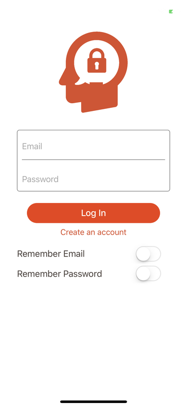
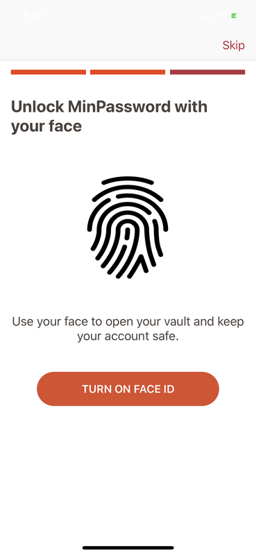
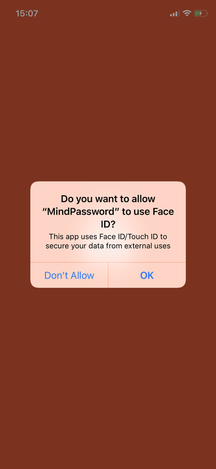
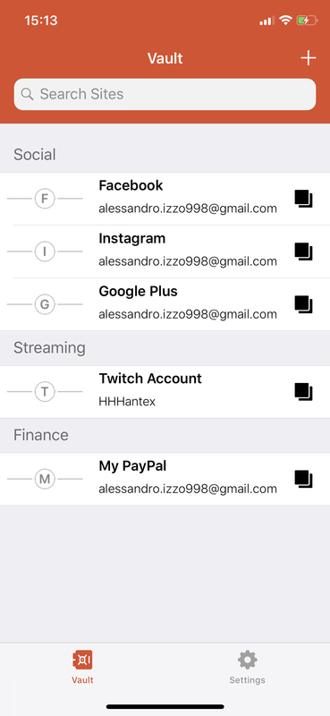
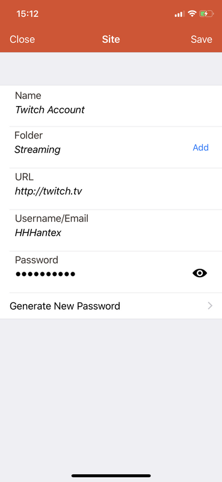
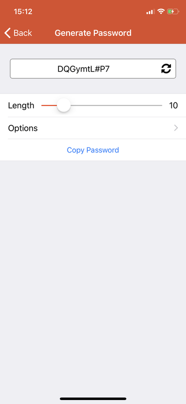
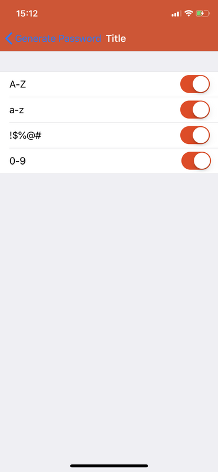
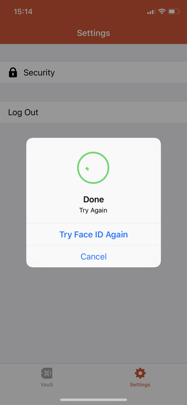
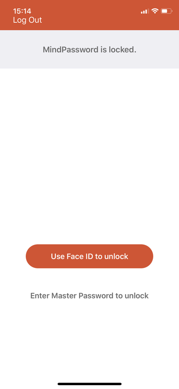
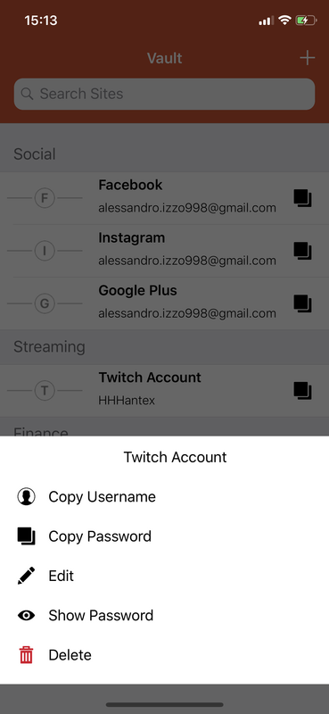

  
  <h1 align = "center">MindPassword</h1>

MindPassword is an app designed for all those users who need to remember different passwords related to the many accounts held. It allows you to save your username, password and various information related to your account securely. Takes advantage of the biometric sensors (FaceID, TouchID) to access and view sensitive data; This allows information to be hidden even if the device is used by other people. In addition, for lazy users, MindPassword allows you to generate a secure password by choosing parameters such as length and type of character included.

## Screenshots

  
  

  
  

  
  

  
  

  
  

